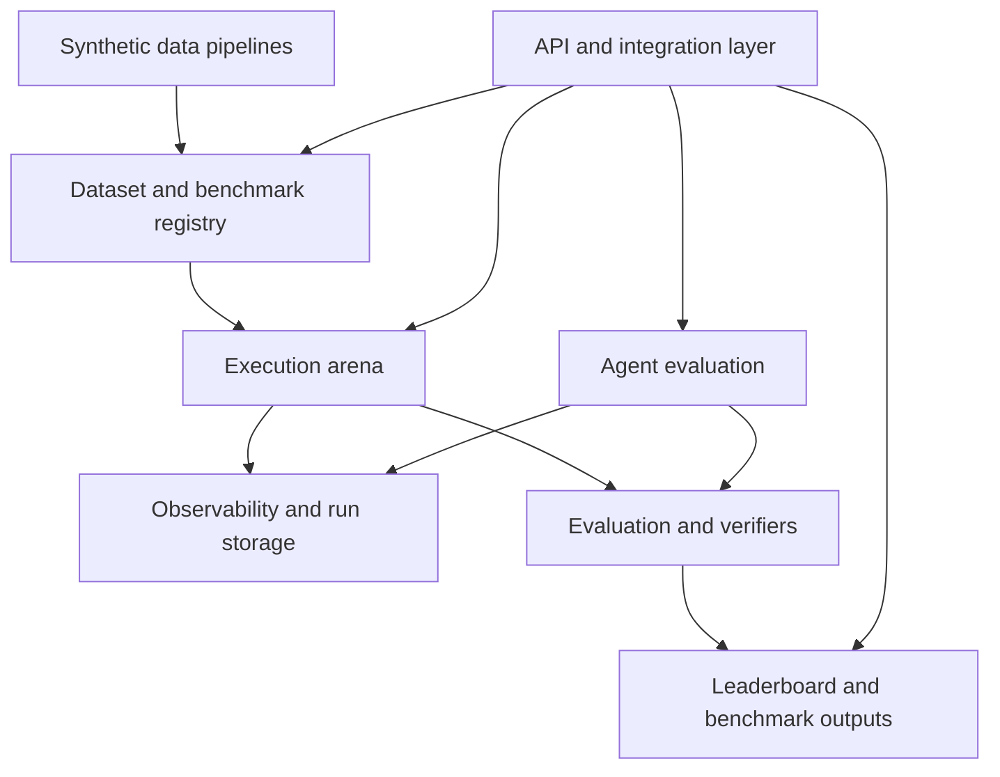

# Open Arena stack notes

This document describes the module-level shape that Open Arena should grow into, using the current repository as the starting point. The current codebase already behaves like a model evaluation runner: it loads a dataset, executes one or more experiments, optionally enables MCP-backed tool use, and scores outputs with either an LLM judge or an LLM verifier. That gives the project a solid execution core, but the future stack implied by the roadmap is broader. It needs to support benchmark-grade data management, richer verifier systems, agent-centric evaluation flows, and synthetic data generation pipelines that can continuously feed the arena.

The stack is easiest to reason about as a set of cooperating modules rather than as a single CLI pipeline. Some of those modules already exist in code, some exist only as partial groundwork, and some are still conceptual.

## 1. Dataset and benchmark registry

At the bottom of the stack, Open Arena needs a dataset and benchmark registry that is richer than a simple stream of rows. Today the repository already has a good ingestion layer: dataset adapters pull examples from local files, Hugging Face, Langfuse, LangSmith, Phoenix, Opik, Braintrust, Weave, and MLflow, then shape them into the canonical `(input, expected_output, metadata)` row used by the execution pipeline. That is the right starting abstraction for model evaluation, but it is not yet a benchmark registry in the stronger sense.

The future module should own dataset identity, dataset versions, source provenance, task type, schema shape, and benchmark output compatibility. A benchmark run should be able to say not only that it used “MMLU Anatomy,” but also which version or revision, what transformation logic was applied, and how the resulting scores should be interpreted downstream. The current code already passes through provider-specific version hints in metadata when the source supports them, but it does not yet unify those ideas into one durable Open Arena data model.

This module should therefore become the canonical source of truth for inputs, references, metadata, scenarios, verifier definitions, and version-aware benchmark descriptors. For model evaluation, the core record can still be input/output-oriented. For agent evaluation, this same module should also support scenario-oriented datasets, where the interesting unit is no longer a single prompt/answer pair but a full task with environment assumptions, tools, trajectory expectations, and verifier attachments.

## 2. Execution arena

The execution arena is the part of the stack that currently exists most clearly in the repository. The CLI loads config, builds rows, uploads or attaches them to Langfuse, executes each experiment, and hands the results to the evaluator layer. It already supports two execution modes: direct model calls and MCP-backed agentic calls. That means Open Arena already has a real arena kernel.

The future version of this module should keep that core, but separate concerns more explicitly. One sub-layer should handle run planning and configuration resolution. Another should handle execution against models, tool-enabled agents, or later deployment endpoints. A third should emit a normalized run artifact that other modules can consume regardless of how execution happened. Today `ExecutionResult` is close to such an artifact, especially because it already captures trajectories for MCP-enabled runs, but it is still optimized for the current Langfuse-centric pipeline rather than for a broader platform.

Over time this module should also become step-aware. Right now trajectories can be collected and passed to evaluators, but the arena itself still treats the run mostly as a row-level event with a final output. If Open Arena is going to evaluate real agents, the arena needs to model turns, tool invocations, intermediate states, and possibly deployment-specific execution metadata as first-class run structure rather than optional attachments.

## 3. Evaluation and verifier subsystem

The evaluation subsystem is the second mature part of the current repository. It already has a clean split between pointwise and group evaluators, plus two concrete methods: `llm_as_judge` and `llm_as_verifier`. The judge path handles row-by-row scoring, while the verifier path implements pairwise comparison with score extraction from logprobs. This means Open Arena already has more than a thin “grade with one prompt” layer; it has the beginnings of a reusable verification engine.

In the target stack, however, this module should be broader and more modular. It should not be limited to one judge family and one verifier family. It should provide a common contract for semantic metrics, reference-based and reference-free grading, pairwise and panel methods, trajectory-aware checks, and task-specific validators. If the project adopts external metric engines such as DeepEval, this is the module that should wrap them and normalize their outputs into a common scoring model.

This subsystem should also bridge the gap between model evaluation and agent evaluation. For model runs, it can continue to score final outputs. For agent runs, it should be able to score both end-to-end outcomes and step-level behavior. The current code hints at this direction because trajectories are already injected into judge and verifier payloads, but there is no dedicated step-level scoring contract yet. That missing layer is important: once trajectories are first-class, evaluators should be able to reason about tool correctness, failure recovery, planning quality, and policy adherence separately from final answer quality.

## 4. Observability, run storage, and benchmark outputs

Today Open Arena is strongly coupled to Langfuse for run storage, tracing, and score persistence. That is entirely workable for the current product, and the repository is honest about it. The future stack, though, should treat observability and benchmark outputs as related but distinct concerns.

One part of this module should remain focused on rich tracing and inspection. Langfuse already fills that role well, and it can remain a primary backend. Another part should focus on benchmark-grade outputs: a stable run summary, score cards, version-aware aggregates, and leaderboard-ready records. Those outputs should not depend on a single observability backend. In other words, the project should eventually distinguish between “where the run was traced” and “where the benchmark result lives.”

This module is also where a durable leaderboard data model belongs. Scores should be grouped by benchmark, dataset version, task type, experiment configuration, evaluation method, and date. The current repository writes scores back to individual Langfuse traces, but it does not yet create a portable benchmark artifact that can be stored elsewhere or consumed independently.

## 5. Agent evaluation

Agent evaluation is mostly absent from the current codebase, but the target stack clearly needs it as its own top-level module rather than as a special case of MCP-enabled execution. The future module should support evaluation against deployed agent endpoints, normalized trajectory capture, response models for agent runs, and datasets whose unit of work is a scenario rather than a single prompt.

At the moment, Open Arena can execute a model with MCP tools and capture a trajectory. That is useful groundwork, but it is not the same as evaluating an agent system end to end. A proper agent evaluation module should understand remote agent protocols, endpoint contracts, and result envelopes. It should also be able to attach verifiers that inspect both the final outcome and the path taken to get there.

This is also where future sandbox support belongs. Not every agent benchmark needs a sandbox, but once the project wants to evaluate multi-step behavior against mutable environments, it will need a way to define environment setup, side effects, cleanup, and isolation boundaries. That capability is not needed for the current repository to be valuable, but it is central to the longer-term architecture.

## 6. Synthetic data pipelines

The roadmap also implies a synthetic data module that can create or expand benchmark datasets from traces, documents, and contextual sources. Nothing like that exists in the repository today, so it should be treated as a new top-level subsystem rather than as an extension of the current dataset adapters.

This module should ingest source artifacts, transform them into candidate tasks, run selection and deduplication steps, and publish benchmark-ready outputs back into the dataset and benchmark registry. For large trace collections, it will likely need a staged flow: ingestion, normalization, embedding or diversity selection, synthetic generation, verification, and publication. The exact pipeline technology can evolve, but conceptually the important thing is that synthetic generation should be part of the Open Arena stack rather than an external one-off preprocessing script.

The interface between this module and the registry module is especially important. Synthetic pipelines should not only emit rows; they should emit versioned datasets with provenance. That way the arena can evaluate against generated benchmarks while preserving how those benchmarks were built.

## 7. API and integration layer

The current repository is CLI-first. That is appropriate for now, but the future stack should include an integration-facing module that exposes the arena capabilities over stable APIs. This does not have to replace the CLI; it should sit beside it and use the same internal modules.

An API layer would make it possible to submit benchmark jobs, query dataset versions, trigger synthetic pipelines, inspect leaderboard outputs, or evaluate external agent deployments without treating the CLI as the only entry point. It would also be the right place to host protocol adapters for future agent-evaluation endpoints and external orchestration systems.

## Recommended framing

Taken together, the Open Arena stack should be framed as a platform with a strong current execution core and four major expansion fronts: a benchmark-grade data registry, a broader verifier framework, a dedicated agent-evaluation layer, and synthetic-data pipelines. The current repository already contains the seed of the execution arena and evaluation subsystem. The rest of the architecture should be designed to plug into those pieces without forcing everything through one Langfuse-specific CLI path.
